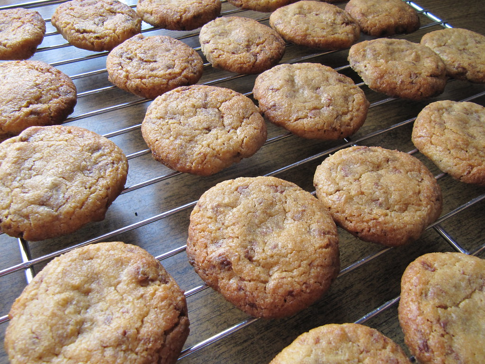

## Design Patterns
On my first look at design patterns, I had no idea what I was looking at with all of their fancy names. Although [Patterns.dev](https://www.patterns.dev/#patterns) focuses on Javascript and React, upon closer inspection of the design patterns were not only applied within ICS 314, but in other ICS classes as well. The question shifted from, “What are design patterns?” to “Which design patterns have we used?”

### Cookies?

To me “Design patterns” are an elegant way to define how things are done. For example if you wanted to bake different kinds of cookies would you follow a single recipe, modifying certain ingredients or do you follow separate recipes. If you want a chocolate chip cookie instead of whatever a plain cookie is, do you just add chocolate chips during mixing? If that is the case, it would be similar to a prototype pattern of inheritance, where a chocolate chip cookie is an extension of a cookie.

Many people are probably utilizing design patterns and just do not think about them. Regarding the final project for ICS 314 we utilized subscriptions to display the order’s containers allowing for responsive updates. Which is an example of “Observer Pattern.” For a standard object-oriented approach of inheritance like the cookie example would be a “Prototype Pattern.”

Knowing these patterns I believe are unnecessary for an experienced programmer, but for me, it helps highlight methods for organization. Many design patterns can be used together to solve a problem, but sometimes your solution may fall outside of common design patterns. These common design patterns will lay the groundwork for your own software development, in the same way that you can become more creative with your cooking or baking. After enough time passes you can make your own recipes to hopefully make deliciously baked cookies.
