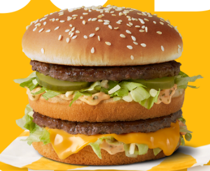
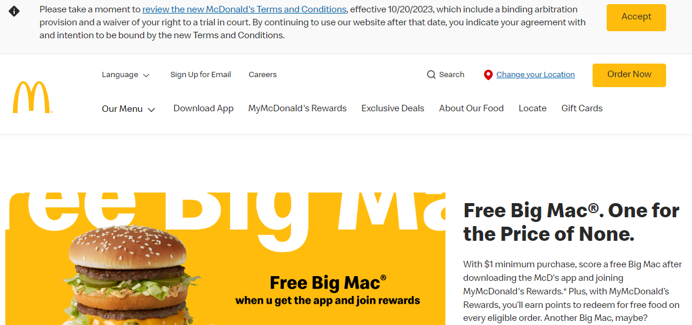
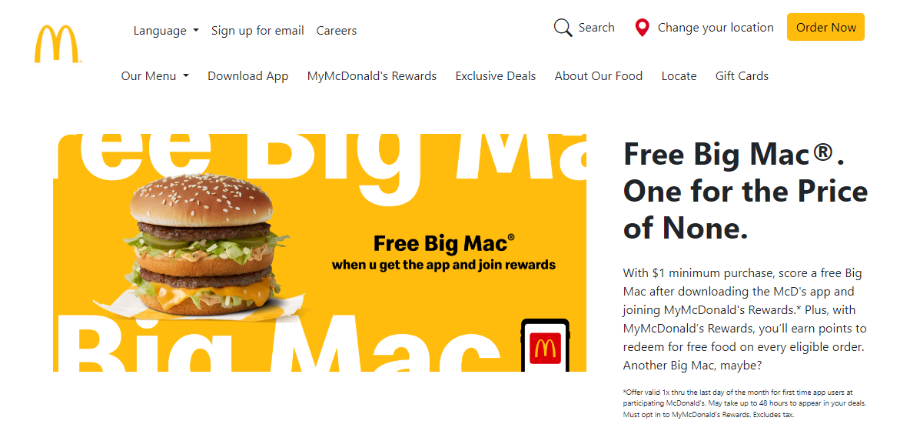
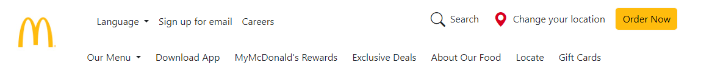
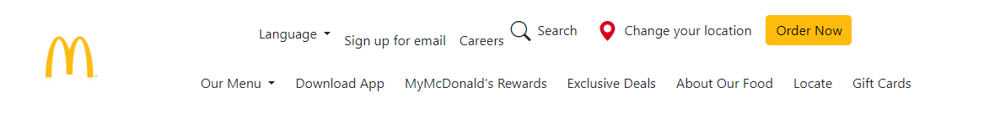
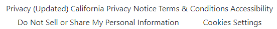

  

## Not McDonald's  

Using Bootstrap, HTML, and CSS, I reproduced the McDonald’s website. Visually. To an extent.  
The top one being the real McDonald's.  

***
  

***

***

## HTML, CSS, and Bootstrap  

HTML and CSS were extremely complicated, with many classes you can make to apply styling and formatting to HTML text. Bootstrap helped quite a lot in the development of my clone McDonald’s site since I have no experience with CSS. By having many
premade classes, I can somewhat obtain the styling that I was aiming for. But Bootstrap has the same issues that HTML, CSS, and any programming language have: It is hard to learn what you can do with it. But anyway bootstrap allowed me to somewhat
recreate McDonald’s website. I would have a much harder time if I were to use raw HTML and CSS. Unless you are aiming to become a web developer, or someone specializing in UI design there is not much need to have strong HTML and CSS knowledge.

## Personal Applications

Even if you wanted to purely focus on back-end development. Knowing the bare minimum in UI development is important to testing and presenting your work to others. A little presentability goes a long way. 

Take the two images below:  

***  
  

***
  

***
One looks a little better than the other, but if this were someone’s test for their backend, looking a little better makes no difference.  

But what if it looked like this:  

***

***
Where the words are essentially merging together, a solo developer may be able to see past this when testing, but it will take time for onlookers to understand.
