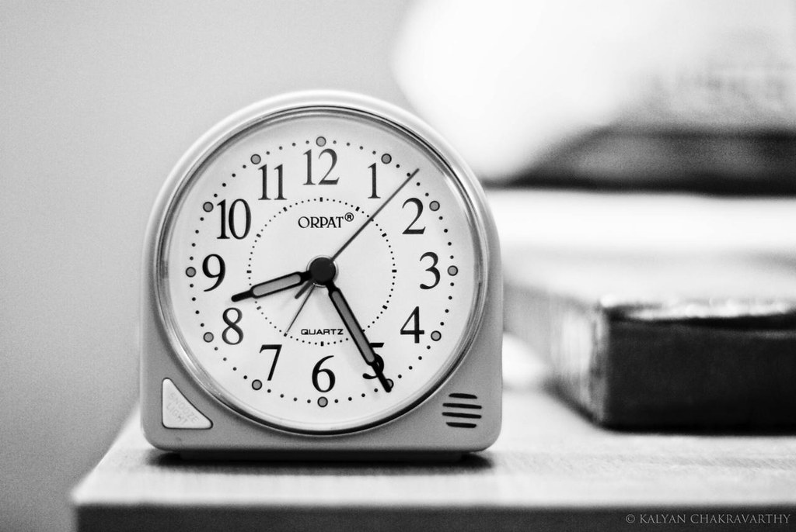

# Time Estimation 

For our ICS 314 Final Project (Full Cycle Takeout), we as a team tracked the time spent on coding and other project related efforts. We utilized IntelliJ’s in-built timer (Darkyen's Time Tracker) to keep track of our coding time. The same timer was also used to get an estimation of the time spent on non-coding (it measures the time you were away), but the issue is that it takes some time for it to start when you stop coding and it will continue timing when you start coding again. In a more reliable fashion we used our phone timers to get a time estimate of total time spent and used that to roughly determine the time spent not coding.

Overall my tracking was not too accurate, but gave a decent estimation on the time I roughly spent for each issue. Especially since I took many breaks to rest my mind and had spread out the work over a few days.

## Making Time Estimates

My time estimates were based on my own experiences. When performing both in-class and practice “Workout of the Days” (WODs). I would severely underestimate the difficulty of the assignment and thus took a lot of time to complete the WODs. Using that knowledge I created a time estimate that would be on the upper end, much higher than the WODs “Did Not Finish” (DNF) times.

Making estimates ahead of time helped by giving a heads-up on how difficult an issue probably is. Being able to spend time before coding and between coding sessions helped cut down on actual coding time. Although it only helped so much, since I got stuck when trying to link forms to the database.

## Reflecting on Time Tracking

Tracking the time spent coding was a little stressful as your time slowly ticked up towards the estimated time. In the same sense the time sensitivity for WODs increased the pressure as you tried your best programming. Except that there was slightly less pressure since I was not actually restricted to a designated time.

Tracking time, I believe was not too helpful as it was a weight on my shoulders, but when looking back from after the project. Just like how WODs highlighted my own weaknesses, by reviewing my initial estimations and comparing them to the time I actually spent, I can see that they were usually over-estimates, except for a few outliers. Which tells me that I still do not fully comprehend the difficulty of developing an application.

## Links

[Link to Time Tracking Spreadsheet](https://docs.google.com/spreadsheets/d/e/2PACX-1vSpWs9wNRyBTSAuWW_HSxfkSgOlvZpSBZnhgIkCxxWdZw1y43XH4lC4f2D8cQ82JgqRiliV1tmWmITx/pubhtml)
