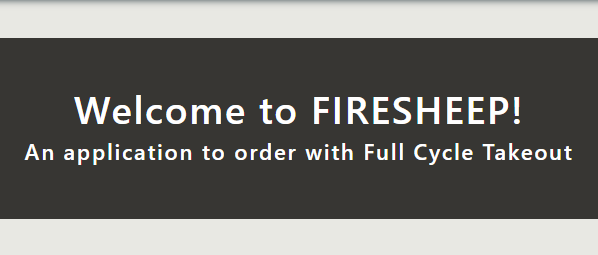
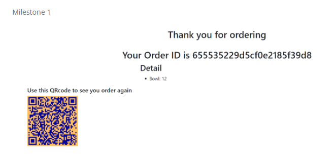
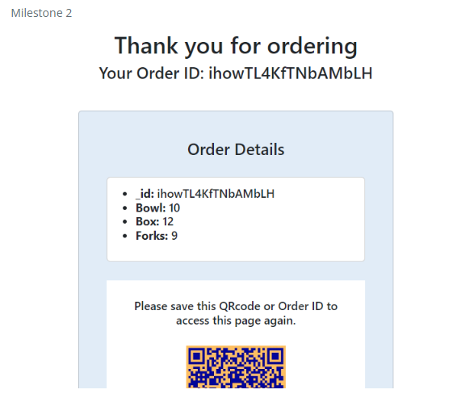
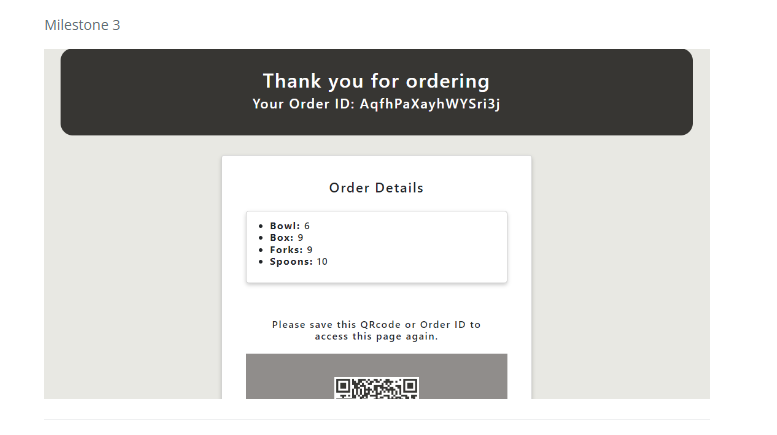

# HACC Full Cycle Takeout
For the 2023 Hawaii Annual Code Challenge, me and four others (Brain Shu, Elijah Saloma, Joy Tan and Samuel Yang), took on the challenge proposed by Zero Waste Oahu [(Click here to see the full list of challenges)](https://hacc.hawaii.gov/challenges/). The objective was to create an application to supplement their Full Cycle Takeout, a reusable container and utensils rental program. The end goal was for the application to speed up the process of keeping track of rentals and to hold those who rented items financially responsible. 

## ICS 314 Full Cycle Takeout
The HACC project was developed using Express.js, Firebase, and Mongoose, alongside MongoDB, qrCode, and React. The issue with this was that for ICS 314, it would be constructed using MeteorJS, MongoDB, and React. So the application developed for the HACC had to be adapted to fit the final project class requirements.

## What was learned
For this project I got my first look into software development as a team. Being able to apply and practice skills learned in class: Meteor, Mongo, React, project management, TestCafe and Digital Ocean hosting.

During the project we applied Issue Driven Project Management (IDPM) in a semi-realistic setting. I previously shared my thoughts on it in my essay titled ["Software Engineering and ICS 314"](https://anson2leung.github.io/essays/software-engineering-and-ics314.html). As a summary IDPM is an example of agile project management, with its unique aspect of dividing up the project into smaller tasks called "issues."
Breaking down and delegating tasks for IDPM were difficult as it was hard to assess the difficulty of certain tasks, as many parts would build off another. Developing off a previous issue would also require a clear understanding of the inner-workings of those previous issues.

Although comparatively my abilities for Meteor are not impressive, I was able to learn and support my team members for both front and back-end, alongside handling the documentation of our project. You can see them on our project page: [https://314firesheep.github.io](https://314firesheep.github.io) 

### Examples
Images come from our Project page linked above. Images are cut-off as I was unable to take a screenshot of the entire page.

_The prototype implementation of the result page, after placing an order you will be redirected here._

_After formatting the page becomes..._

_After styling the ends up as..._

## Links
Link to GitHub repository

[https://github.com/314FireSheep/FullCycleTakeout](https://github.com/314FireSheep/FullCycleTakeout)

Link to Project Page

[https://314firesheep.github.io](https://314firesheep.github.io)

Link to application

[https://firesheep.me](https://firesheep.me)
