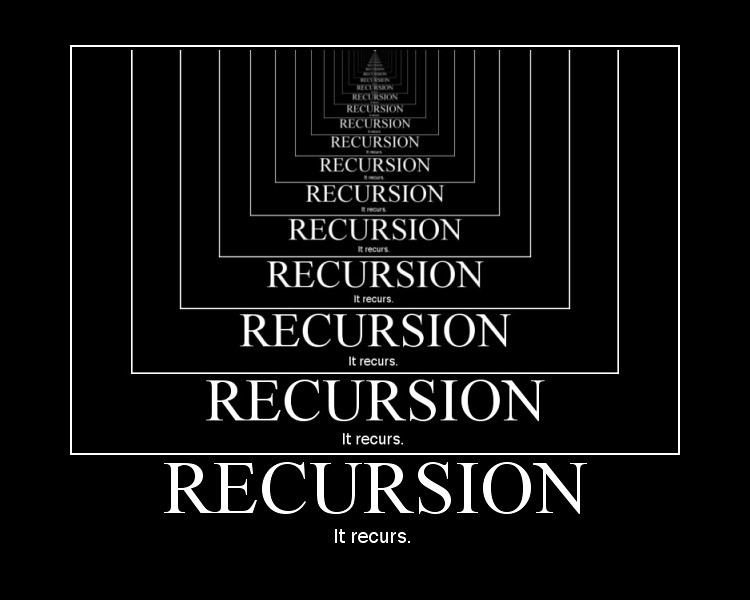

# Overview
The objective of this assignment was to complete the function "fillSudoku(int[][]sudoku). As the title suggests the purpose of the function is to return a valid Sudoku with all of its spaces filled. Although the assignment was short, it tested the extent of our understanding and application of recursion.

[Learn about Sudokus here](https://en.wikipedia.org/wiki/Sudoku)

Each individual was to implement a working Sudoku solver. The function fillSudoku took in a 2-D int array which is the representation of the Sudoku, and returns a boolean. The function returns true if the Sudoku is complete, but a false return value can be utilized in solving the Sudoku.
# My Implementation
```c
public static boolean fillSudoku(int[][]sudoku) {
	    //Find 0
	    int row = 0; //row
	    int col = 0; //col
	    boolean found = false; // if a zero was found
	    //find next empty cell
	    for(int i = 0; i < sudoku.length; i++) {
	    	if(found == true) {
	    		break;
	    	}
	    	for(int j = 0; j < sudoku[i].length; j++) {
	    		//System.out.println(sudoku[i][j]); //testing iteration
	    		if(sudoku[i][j]==0) {
	    			row = i;
	    			col = j;
	    			found = true;
	    			break;
	    		}
	    	}
	    }
	    //Is the Sudoku complete?
	    if (found == false && Sudoku.checkSudoku(sudoku, false)) {
	    	return true;
	    }
	    
	    for(int i = 1; i < 11; i++) { // it will go to 10
	    	sudoku[row][col] = i;
	    	/**
	    	 * Had a problem where if a 9 was a valid it would not clear and backtrack
	    	 * so I let the value increment once more so if it gets to 10 then I backtrack 
	    	 */
	    	if(sudoku[row][col]>9) {
	    		//reset current position and backtrack
	    		sudoku[row][col] = 0;
	    		return false;
	    	}
	    	if(Sudoku.checkSudoku(sudoku, false)) {
	    		//if the sudoku is complete, end all the recursions
	    		if(Sudoku.fillSudoku(sudoku)) {
	    			return true;
	    		}
	    	}
	    }
	    return false;
  }
```
# Difficulties
## Fail Condition
The Sudoku is solved using a brute force approch, attemping each possible answer until a correct one is uncovered. See the following exerpt of the above code...
```c
    for(int i = 1; i < 11; i++) {
```
On the first reading of the assignment it is natural to believe that to test each possible solution you will loop from 1-9 (the loop being from i<10), being each possible number in a Sudoku. But there was tons of problems, what should have been an easy solution was much more complicated than it seemed.

I was confused why my code was either falling into an infinite loop or getting stuck. After going through a bunch of debugging, getting fustrated and all, it was then that I noticed that the issues occured when the solution for a particular square was a "9."

I was on my way home in my parent's car, thinking about the issue I had. Since we were stuck in traffic, I decided to just brainstorm some ideas on how the issue was caused. When I had the greatest, tiny breakthrough to change the fail condition of the code. Previously the loop stopped at 9 since I thought, "if it did not work the issue was at a previous number." Which was true, but sharing a possible solution with a fail condition was causing issues, so I allowed for the loop to go from 1-10.