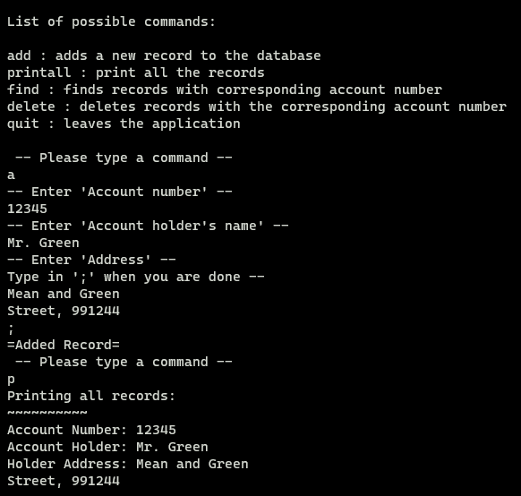

# Overview
The final coding assignment in ICS 212, Spring 2023. This project primarily helped me learn how to read and write data into a txt file.

Using a linked list to store account information such as their account number, name and address, allowing for a user to interact and add new entries or remove entries in the database. 

When the user is done, the data is saved into a txt file, which will be read upon the next startup of the program.

# Difficulties
## Saving Data
### Writing data to a file
The purpose of the writefile function is to iterate through the linkedlist database, read each record object and save that data into a txt file.

```c
void writefile(struct record* database, char filename[])
{
    struct record* curr_Record = database;
    FILE *file = fopen( filename, "w" );
    
    while (curr_Record != NULL)
    {
        fprintf ( file, "%d\n%s%s;\n", curr_Record->accountno, curr_Record->name, curr_Record->address);
        curr_Record = curr_Record->next;
    }
    fclose(file);
    return;
}
```
### Memory leak prevention
Accomplished by iterating through the linkedlist, using the free function to release space reserved by the malloc function, before removing their pointers.

```c
void cleanup(struct record** database)
{
    struct record* curr;
    curr = *database;
    while ( curr != NULL )
    {
        struct record * temp;
        temp = curr->next;
        curr->next = NULL;
        free (curr);
        curr = temp;
    }
    return;
}
```

### Adding data to the linkedlist "database" from a txt file
This readfile function was the main source of difficulty. The reason being the open-ended nature on how to save our data into a txt file. I decided to put each value for each record on their own line. But that causes a problem for an account holder's address, which allows for multiple line addresses.
```c
void readfile(struct record** database, char filename[])
{
    FILE *file;
    file = fopen( filename, "r" );
    if ( file != NULL )
    {
        int anum;
        while ( EOF != fscanf ( file, "%d", &anum ))
        {
            char c = '\0';
            char aname[30] = "";
            char aaddress[50] = "";
            fgetc (file);
            fgets ( aname, 30, file );
            while ( c != ';' )
            {
                c = fgetc(file);
                if ( c != ';')
                {
                    strncat( aaddress, &c, 1 );
                }
            }
            c = fgetc(file);
            addRecord ( database, anum, aname, aaddress );
            if ( debugMode == 1 )
            {
                printf( "readfile added a record\n" );
            }
        }
        fclose(file);
    }
    return;
}
}
```
### Function to create a linked node
All the data collected by readfile is used to create the records in the linkedlist database using this addRecord function.
```c
void addRecord(struct record** database, int actnum, char name[], char address[])
{
    struct record* new_Record;
    struct record* prev_Record;
    struct record* curr_Record;
    int done;
    if ( debugMode == 1 )
    {
        printf( "D: addRecord has been called with database** %p, account number %d,\n", database, actnum );
        printf( "the name: %s\n", name );
        printf( "the address: %s\n", address );
    }
    new_Record = (struct record*) malloc( sizeof(struct record) );
    done = -1;

    new_Record->accountno = actnum;
    strncpy( new_Record->name, name, 30 );
    strncpy( new_Record->address, address, 50 );

    if ( *database == NULL )
    {
        new_Record->next = NULL;
        *database = new_Record;
    }
    else if ( actnum < (*database)->accountno )
    {
        new_Record->next = *database;
        *database = new_Record;
    }
    else if (actnum == (*database)->accountno)
    {
        new_Record->next = NULL;
        (*database)->next = new_Record;
    }
    else
    {
        prev_Record = *database;
        curr_Record = (*database)->next;
        while ( done == -1 )
        {
            if ( curr_Record == NULL )
            {
                new_Record->next = NULL;
                prev_Record->next = new_Record;
                done = 0;
            }
            else if ( curr_Record->accountno < actnum )
            {
                prev_Record = curr_Record;
                curr_Record = curr_Record->next;
            }
            else 
            {
                new_Record->next = prev_Record->next;
                prev_Record->next = new_Record;
                done = 0;
            }
        }
    }

    if ( debugMode == 1 )
    {
        printf( "\nD: addRecord finished\n" );
    }
}
```

# Final Thoughts
What I learned from this project was that I had quite the hard time with pointers. It took me a long time to understand the uses between pointers and dereferences (since they both are signaled with an asterisk). 