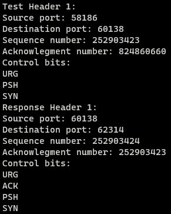

# Overview
The main goal of this assignment from ICS 211 was to develop a program that can read a binary file (containing information of a TCP header), generate a TCP response header, and to write the TCP response header into a binary file.

This assignment also tested your knowledge of bit-wise operators, as they are necessary in creating the response header.

## Printing a header
Simply converts a TCP header that being stored in a unsigned char array to a format more understandable to humans. Each byte is associated with a certain part of the TCP header. For more percise sections, a mixture of bit-shifts and bitwise operators are used.

```c
void printheader(const unsigned char headArr[])
{
    unsigned int seqnum;
    unsigned int acknum;
    int loop;
    printf("Source port: %d\n", headArr[1]<<8 | headArr[0]);
    printf("Destination port: %d\n", headArr[3]<<8 | headArr[2]);

    for (loop = 7; loop > 3; loop--)
    {
        seqnum = seqnum<<8 | headArr[loop];
    }
    printf("Sequence number: %u\n", seqnum);

    for (loop = 11; loop > 7; loop--)
    {
        acknum = acknum<<8 | headArr[loop];
    }
    printf("Acknowlegment number: %u\n", acknum);

    printf("Control bits: \n");
    if ((headArr[13] & 32) != 0)
    {
        printf("URG\n");
    }
    if ((headArr[13] & 16) != 0)
    {
        printf("ACK\n");
    }
    if ((headArr[13] & 8) != 0)
    {
        printf("PSH\n");
    }
    if ((headArr[13] & 4) != 0)
    {
        printf("RST\n");
    }
    if ((headArr[13] & 2) != 0)
    {
        printf("SYN\n");
    }
    if ((headArr[13] & 1) != 0)
    {
        printf("FIN\n");
    }
    return;
}
```

# Difficulties
## Creating a response header
Implementing a response header function was not too difficult, but it was a long process. Since there is a percise set of changes performed on the input TCP header to generate the response header. One will have to go through each part slowly to confirm they are creating the response header correctly, since it is easy to mix-up their byte locations.
```c
void makeheader(const unsigned char inputTCP[], unsigned char responseTCP[])
{
    unsigned int sequence;

    /*Source port Greater than 32767, by checking if second byte is greater than 128 swap */
    if ((inputTCP[1] & (1<<7)) != 0 )
    {
        /*pre-emptively setting them to destination ports*/
        /*flip 4th bit: second byte 5th from the right*/
        responseTCP[3] = inputTCP[1] ^ (1<<4);

        /*flip 11th bit: first byte 6th from the right */
        responseTCP[2] = inputTCP[0] ^ (1<<5);
    }
    else
    {
        responseTCP[3] = inputTCP[1];
        responseTCP[2] = inputTCP[0];
    }

    /*switch source and destination*/
    responseTCP[1] = inputTCP[3];
    responseTCP[0] = inputTCP[2];

    /*set acknowledgment to sequence*/
    responseTCP[8] = inputTCP[4];
    responseTCP[9] = inputTCP[5];
    responseTCP[10] = inputTCP[6];
    responseTCP[11] = inputTCP[7];

    /*set sequence number to sequence number++*/
    sequence = inputTCP[7]<<24 | inputTCP[6]<<16 | inputTCP[5]<<8 | inputTCP[4];
    sequence++;
    responseTCP[4] = sequence & 255;
    responseTCP[5] = sequence>>8 & 255;
    responseTCP[6] = sequence>>16 & 255;
    responseTCP[7] = sequence>>24 & 255;

    /*Control bits are in the 14th byte the last 6 bits*/
    responseTCP[13] = inputTCP[13] & 63;

    /*check for SYN 2nd bit from the right in the 14th byte*/
    if ((inputTCP[13] & (1<<1)) !=0 )
    {
        responseTCP[13] = (responseTCP[13] | 18);
    }

    /* the rest*/
    responseTCP[12] = inputTCP[12];
    responseTCP[14] = inputTCP[14];
    responseTCP[15] = inputTCP[15];
    responseTCP[16] = inputTCP[16];
    responseTCP[17] = inputTCP[17];
    responseTCP[18] = inputTCP[18];
    responseTCP[19] = inputTCP[19];

    return;
}
```

<hf>

# Final Thoughts
Figuring the correct use of bitwise operators for this assignment was very interesting. Although this assignment seemed very daunting at first, seeing yourself progress through each section gives you encouragment to continue. Before I knew it I was almost done.